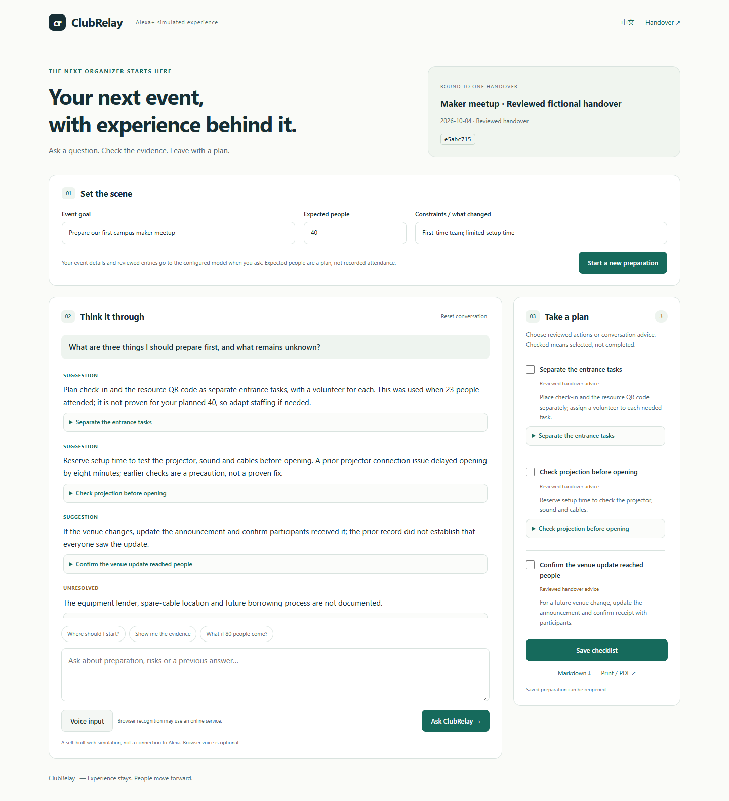

# ClubRelay

**Help the next student organizer turn a reviewed handover into an evidence-backed preparation plan.**

Built for the **Alexa+ simulated-experience path** of the Amazon Developer Hackathon. This is a self-built local web app, not a connection to real Alexa. It does not implement an MCP server or use the gated Alexa+ developer preview. No AWS or Open Source mini-challenge is claimed.



## What works

- One reviewed handover, one organizer's event context, multi-turn follow-up questions.
- Short answers labelled as recorded facts, suggestions or unresolved gaps; expandable original evidence.
- A saved preparation checklist containing selected reviewed advice or newly generated conversation suggestions, with Markdown and print/PDF export. Selection is not task completion.
- Persistent owner-scoped preparation, source-change checks, consent checks and duplicate-request protection.
- English and Chinese interface; optional browser speech recognition and local-system read-aloud. Text remains available when voice fails.

## Run locally

Python 3.11+ is required. Windows is the verified environment; Linux/macOS instructions are provided but not independently tested. No paid infrastructure or hardware is needed to install the application. Live AI generation requires **your own compatible model endpoint**; no API key, model weights or credits are included. The recording demonstrates genuine model requests using a pre-existing connection. It does not mean an endpoint is bundled.

```powershell
python -m venv .venv
.\.venv\Scripts\python.exe -m pip install -r requirements.txt
.\start-amazon.ps1
```

For Linux/macOS:

```sh
python3 -m venv .venv
. .venv/bin/activate
pip install -r requirements.txt
export QINGLIAN_DATA_DIR="$PWD/var/clubrelay-amazon"
python manage.py migrate --noinput
python manage.py seed_amazon_demo
python manage.py runserver 127.0.0.1:8023 --noreload --insecure
```

Open http://127.0.0.1:8023/login/ . The username is `manager`; the randomly generated local password is in `var/clubrelay-amazon/demo-accounts.json`. These credentials are created on your machine and are not published.

1. Open `/settings/`. Select an OpenAI-compatible localhost endpoint, or one of the supported cloud providers. Keep any key local. Local endpoints send a key only when local authentication is explicitly enabled. On platforms without Windows DPAPI, set `QINGLIAN_AI_API_KEY` in the environment rather than storing a key in the UI. The Windows launcher intentionally clears inherited keys; use the project's own credential settings there.
2. Open the fictional event, then its handover permission page. Select the three English fictional documents and explicitly permit processing with the chosen model. Settings changes invalidate that consent.
3. Open `/handoffs/e5abc715-cdf8-5514-983b-c88cd1a31672/briefing/?lang=en`.
4. Save the goal, expected attendance and constraints. Ask a question, inspect evidence, select three actions, save and export.

The pre-reviewed handover is an explicitly **manually authored test fixture**, not an AI result or a real organizer's acceptance. Seeding does not enable a model or make a model call. With no model configured, the handover can still be inspected at `/handoffs/e5abc715-cdf8-5514-983b-c88cd1a31672/`; generation remains disabled.

## Try these questions

1. What are three things I should prepare first, and what remains unknown?
2. Why do you suggest checking the projector? What evidence supports that?
3. Who lends the equipment? Can we infer that from the handover?
4. If we expect 80 people this time, what changes? Distinguish expected attendance from the recorded event.

Expected boundaries: 40 was planned, 23 was recorded; an eight-minute projector delay does not prove the cause; the lender is unknown; 80 is a hypothetical future attendance.

## Validation

The private development workspace passed backend regression and isolated browser checks, plus four initial live-model questions and three additional live questions during recording. See `docs/VALIDATION.md` for exact counts and limits.

```powershell
$env:QINGLIAN_DATA_DIR = Join-Path $PWD 'var\clubrelay-tests'
.\.venv\Scripts\python.exe manage.py test operations collector --noinput
```

The historical `knowledge` test suite describes a retired member-access workflow and is not the current access-policy acceptance suite. Ordinary members remain blocked.

## Scope and limitations

Local single-workspace prototype; bind only to loopback. Do not expose the development server to the public Internet. Existing manager accounts share the underlying workspace, while preparation sessions are owner-scoped. This is not a multi-tenant service.

Citation-ID validation checks membership, not whether every generated sentence is semantically entailed. A reviewer should inspect applicability. Only the most recent five successful turns, shortened to the input budget, are provided to the model. A preparation holds at most 40 attempts; start a new preparation when full. Speech recognition may use the browser vendor's online service and requires microphone permission. Real microphone capture has not been accepted by a human tester. Read-aloud uses matching local voices only.

Two student-organizer trials and final owner acceptance remain pending. There is no claimed measured efficiency gain, prize, formal submission or real Alexa integration.

## Source map

`operations/` contains the handover/preparation services, models, views, migration and static assets. `templates/` contains server-rendered pages. `examples/amazon/` contains the three fictional English files. `campus/` holds local application configuration; `activities/`, `knowledge/`, `collector/` and the isolated bridge sources are retained dependencies of the existing campus application. `docs/` contains submission text, validation and the example output.

## Provenance and license

The project extends an existing private campus-management application. Handover work began October 2–3, 2026; the Amazon preparation feature was implemented October 3–4. Earlier functionality is disclosed rather than presented as entirely new. See `docs/CHANGES.md` and `docs/PROJECT_EN.md`.

Original code: MIT. The SpotlightCard adaptation and dependencies retain their own licenses; see `THIRD_PARTY_NOTICES.md`. No private databases, credentials, member records, model endpoint settings or internal logs are included.
